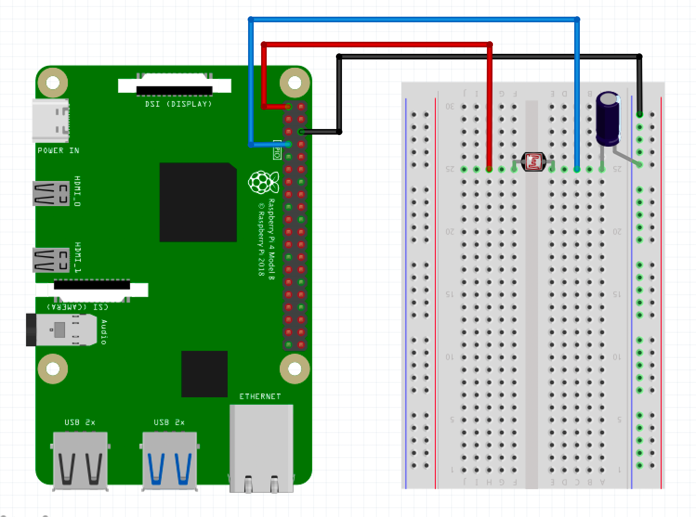

# RNBO-RPi-LDR

In this article we'll cover how to use some simple sensors with RNBO on the Raspberry Pi target.

> [!warning] The following tutorial is not yet supported on the RPi 5

> ⚙️ *Before attempting this tutorial, make sure you're already familiar with the basics of exporting your RNBO patchers to the RPi and that your audio interface is working correctly with it.*

## Things you'll need:

- 1 x 1uf capacitor
- 1 x Light Dependent Resistor (aka Photoresistor)
- Breadboard
- Hook up wires

We'll start by exporting the following patcher to the Raspberry Pi target:


To control the cutoff parameter of this patcher with an LDR, we'll write a quick python script on the Raspberry Pi to use alongside the rnbo runner - ssh in, or connect up a keyboard. We'll use a library that should already be on your RPi image called `gpiozero` and another for communicating with the runner via OSC. You can use any OSC library you like, this example will use `python-osc`.

We'll need to install some system dependencies:

```bash
sudo apt install pigpio python3-pigpio
sudo systemctl enable --now pigpiod
```

Lets first create a working directory and create a python virtual environment:

```bash
mkdir RNBO-LDR
cd RNBO-LDR
python -m venv .venv
```

Now we'll enter the python venv and install some python dependencies:

```bash
source .venv/bin/activate
pip install --upgrade pip gpiozero pigpio python-osc
```

Now `sudo poweroff` the RPi, and disconnect the power. Let's create our circuit:

1. 3.3v (red) from the RPi connects to one side of the LDR
2. GND (black)  from the RPi connects to the ground bus rail
3. The 1uf capacitor connects the shorter leg to the ground bus rail, the longer leg connects to the terminal strip inline with the LDR
4. RPi GPIO 4 (blue) connects in between the LDR and the capacitor

<p align="center" width="100%">
 
</p>


The sensor.value from the LDR is already normalized - so we can use this directly to control the cutoff parameter via the normalized osc address. If you take a look in the patcher, you will see there is some logarithmic scaling of this via `@fromnormalized` which makes it feel more natural.

Switch the Pi back on, ssh in and enter the python virtual env we created before:

```bash
cd RNBO-LDR
source .venv/bin/activate
python RNBO-RPi-LDR.py
```

Now grab a flashlight and voila! You should be opening up and closing the filter with your light source.
